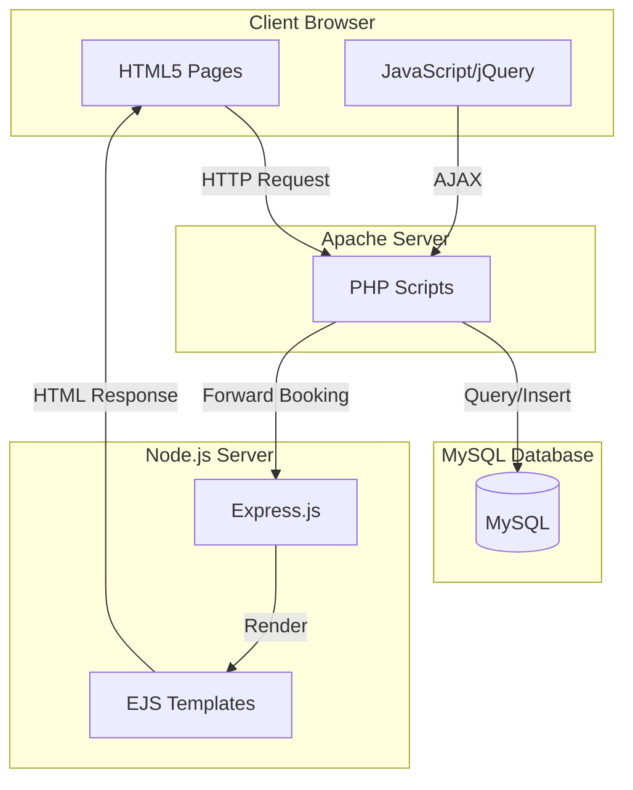
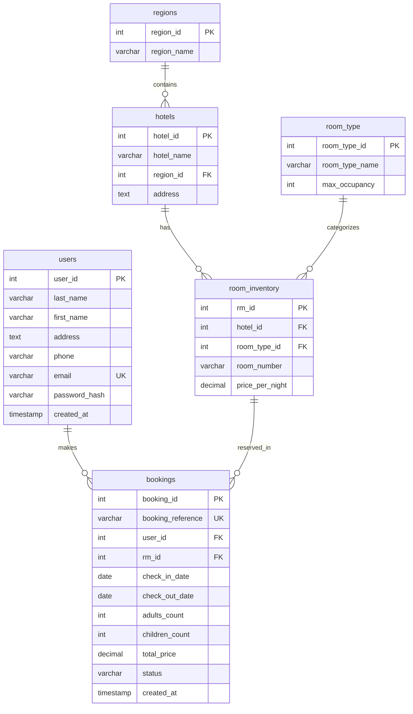

# Design Document

## Overview

The hotel booking system is a full-stack web application that enables users to register, authenticate, search for available hotel rooms, make reservations, and receive confirmations. The architecture follows a hybrid approach with PHP handling authentication and booking logic, MySQL for data persistence, and Node.js/Express serving the final confirmation page.

### Technology Stack

- **Frontend**: HTML5 (XHTML syntax), CSS3, JavaScript, jQuery
- **Backend**: PHP 7.4+, Node.js 16+, Express.js 4.x
- **Database**: MySQL 8.0+
- **Web Server**: Apache 2.4+
- **Session Management**: PHP sessions with 30-minute timeout

### Design Principles

1. **Security First**: All inputs validated, prepared statements only, password hashing, XSS prevention
2. **Atomic Operations**: Database transactions for booking to prevent race conditions
3. **Progressive Enhancement**: Client-side validation with server-side enforcement
4. **Separation of Concerns**: Clear boundaries between presentation, business logic, and data layers

## Architecture

### System Architecture Diagram



### Request Flow

**Registration Flow**:
1. User fills registration form → Client validation (jQuery)
2. Submit → `register.php` → Server validation
3. Hash password → Insert into `users` table
4. Return success/error response

**Login Flow**:
1. User enters credentials → Client validation
2. Submit → `login.php` → Query user by email
3. Verify password with `password_verify()`
4. Create PHP session → Redirect to reservation page

**Booking Flow**:
1. User selects dates/region → AJAX to `get-hotels.php`
2. Display hotels → User selects hotel → AJAX to `get-rooms.php`
3. Display available rooms → User selects room → Submit to `reserve.php`
4. `reserve.php` starts transaction → Lock room → Validate → Insert booking
5. Forward to Express server with booking data
6. Express renders confirmation page

## Components and Interfaces

### Frontend Components

#### 1. Introduction Page (`index.html`)

**Purpose**: Landing page with organization info and navigation

**Elements**:
- Logo image (custom designed)
- Organization description (max 600 words)
- Navigation buttons: "Register" → `register.html`, "Login" → `login.html`

**Styling**: Professional hotel theme with hero image, responsive layout

#### 2. Registration Page (`register.html`)

**Purpose**: New user account creation

**Form Fields**:
- Last Name (text, required)
- First Name (text, required)
- Mailing Address (textarea, required)
- Contact Phone (tel, required, pattern validation)
- Email Address (email, required, unique)
- Password (password, required, min 8 chars)

**Buttons**:
- Register: Submit form to `php/register.php`
- Clear: Reset form fields
- Back to Home: Navigate to `index.html`

**Client Validation**:
```javascript
// jQuery validation
- All fields required
- Email format validation
- Phone format validation (10 digits)
- Password strength (min 8 chars, 1 uppercase, 1 number)
```

#### 3. Login Page (`login.html`)

**Purpose**: User authentication

**Form Fields**:
- Email Address (email, required)
- Password (password, required)

**Buttons**:
- Login: Submit to `php/login.php`
- Back to Home: Navigate to `index.html`

**Client Validation**:
- Email format
- Password not empty

#### 4. Reservation Page (`reserve.html`)

**Purpose**: Search and book hotel rooms

**Sections**:

A. **Search Criteria**:
- Check-in Date (date picker, required, min: today)
- Check-out Date (date picker, required, min: check-in + 1 day)
- Adults Count (number, min: 1, default: 1)
- Children Count (number, min: 0, default: 0)
- Region Filter (dropdown, populated from database)

B. **Hotel List** (dynamically loaded):
- Hotel cards showing: name, address, available room count
- "View Rooms" button for each hotel

C. **Room Selection** (dynamically loaded):
- Room cards showing: room type, room number, max occupancy, price per night
- Total price calculation display
- "Reserve" button for each room

**Buttons**:
- Reserve: Submit to `php/reserve.php`
- Clear: Reset search criteria
- Cancel: Navigate to `index.html`

**AJAX Endpoints**:
- `php/get-hotels.php`: Fetch hotels by region and date range
- `php/get-rooms.php`: Fetch available rooms for selected hotel

**Client Logic**:
```javascript
// Date validation
checkOutDate > checkInDate + 1 day

// Price calculation
totalPrice = pricePerNight × (checkOutDate - checkInDate)

// Occupancy validation
(adults + children) <= maxOccupancy
```

#### 5. Confirmation Page (Express-rendered)

**Purpose**: Display booking confirmation

**Data Displayed**:
- Thank you message
- User email
- Booking reference
- Hotel name and address
- Room type and number
- Check-in and check-out dates
- Number of adults and children
- Total price

**Button**:
- OK: Navigate to `index.html`

### Backend Components

#### PHP Scripts

##### 1. `config.php`

**Purpose**: Database connection and configuration

```php
// Database credentials
define('DB_HOST', 'localhost');
define('DB_NAME', 'hotel_booking');
define('DB_USER', 'root');
define('DB_PASS', '');

// PDO connection with error handling
$pdo = new PDO("mysql:host=".DB_HOST.";dbname=".DB_NAME, DB_USER, DB_PASS);
$pdo->setAttribute(PDO::ATTR_ERRMODE, PDO::ERRMODE_EXCEPTION);

// Session configuration
session_start();
ini_set('session.gc_maxlifetime', 1800); // 30 minutes
```

##### 2. `register.php`

**Purpose**: Handle user registration

**Process**:
1. Validate POST data (server-side)
2. Check email uniqueness
3. Hash password: `password_hash($password, PASSWORD_BCRYPT)`
4. Insert user record with prepared statement
5. Return JSON response: `{success: true/false, message: "..."}`

**SQL**:
```sql
INSERT INTO users (last_name, first_name, address, phone, email, password_hash)
VALUES (?, ?, ?, ?, ?, ?)
```

##### 3. `login.php`

**Purpose**: Authenticate user and create session

**Process**:
1. Validate POST data
2. Query user by email (prepared statement)
3. Verify password: `password_verify($password, $hash)`
4. If valid: Create session variables (`$_SESSION['user_id']`, `$_SESSION['email']`)
5. Return JSON response with redirect URL

**SQL**:
```sql
SELECT user_id, email, password_hash, first_name 
FROM users 
WHERE email = ?
```

##### 4. `get-hotels.php`

**Purpose**: Fetch hotels with available rooms for date range

**Input** (GET/POST):
- region_id
- check_in_date
- check_out_date

**Process**:
1. Validate session
2. Query hotels in region
3. For each hotel, count available rooms (subquery)
4. Return JSON array of hotels with available_count > 0

**SQL**:
```sql
SELECT h.hotel_id, h.hotel_name, h.address,
       (SELECT COUNT(DISTINCT ri.rm_id)
        FROM room_inventory ri
        WHERE ri.hotel_id = h.hotel_id
        AND ri.rm_id NOT IN (
            SELECT b.rm_id FROM bookings b
            WHERE b.status = 'confirmed'
            AND NOT (b.check_out_date <= ? OR b.check_in_date >= ?)
        )) as available_count
FROM hotels h
WHERE h.region_id = ?
HAVING available_count > 0
```

##### 5. `get-rooms.php`

**Purpose**: Fetch available rooms for specific hotel

**Input** (GET/POST):
- hotel_id
- check_in_date
- check_out_date

**Process**:
1. Validate session
2. Query room_inventory with room_type details
3. Exclude rooms with overlapping bookings
4. Return JSON array of available rooms

**SQL**:
```sql
SELECT ri.rm_id, ri.room_number, ri.price_per_night,
       rt.room_type_name, rt.max_occupancy
FROM room_inventory ri
JOIN room_type rt ON ri.room_type_id = rt.room_type_id
WHERE ri.hotel_id = ?
AND ri.rm_id NOT IN (
    SELECT b.rm_id FROM bookings b
    WHERE b.status = 'confirmed'
    AND NOT (b.check_out_date <= ? OR b.check_in_date >= ?)
)
ORDER BY rt.room_type_name, ri.room_number
```

##### 6. `reserve.php`

**Purpose**: Create booking with transaction (critical for overbooking prevention)

**Input** (POST):
- rm_id
- check_in_date
- check_out_date
- adults_count
- children_count

**Process**:
1. Validate session
2. Calculate nights and total_price
3. Generate booking_reference: `'BK' . date('Ymd') . str_pad($sequence, 3, '0', STR_PAD_LEFT)`
4. **Start transaction**
5. Lock room: `SELECT rm_id FROM room_inventory WHERE rm_id = ? FOR UPDATE`
6. Check conflicts: Query overlapping bookings
7. Validate occupancy against max_occupancy
8. Insert booking record
9. **Commit transaction**
10. Forward to Express server via HTTP POST
11. Return Express-generated HTML

**SQL Transaction**:
```sql
START TRANSACTION;

-- Lock the room
SELECT rm_id, price_per_night FROM room_inventory WHERE rm_id = ? FOR UPDATE;

-- Check for conflicts
SELECT COUNT(*) FROM bookings
WHERE rm_id = ? AND status = 'confirmed'
AND NOT (check_out_date <= ? OR check_in_date >= ?);

-- If no conflicts, insert
INSERT INTO bookings (booking_reference, user_id, rm_id, check_in_date, 
                      check_out_date, adults_count, children_count, 
                      total_price, status)
VALUES (?, ?, ?, ?, ?, ?, ?, ?, 'confirmed');

COMMIT;
```

**Forward to Express**:
```php
// Use cURL to POST to Express server
$ch = curl_init('http://localhost:3000/confirmation');
curl_setopt($ch, CURLOPT_POST, 1);
curl_setopt($ch, CURLOPT_POSTFIELDS, json_encode($bookingData));
curl_setopt($ch, CURLOPT_HTTPHEADER, ['Content-Type: application/json']);
curl_setopt($ch, CURLOPT_RETURNTRANSFER, true);
$response = curl_exec($ch);
curl_close($ch);
echo $response; // Return Express HTML to client
```

#### Node.js/Express Server

##### `server/confirmation.js`

**Purpose**: Render booking confirmation page

**Setup**:
```javascript
const express = require('express');
const app = express();
app.set('view engine', 'ejs');
app.set('views', './server/views');
app.use(express.json());
```

**Route**:
```javascript
app.post('/confirmation', (req, res) => {
    const bookingData = req.body;
    // bookingData contains: email, booking_reference, hotel_name, 
    // room_type, room_number, check_in, check_out, adults, children, total_price
    
    res.render('confirmation', { booking: bookingData });
});

app.listen(3000, () => {
    console.log('Express server running on port 3000');
});
```

##### `server/views/confirmation.ejs`

**Purpose**: EJS template for confirmation page

**Template**:
```html
<!DOCTYPE html>
<html>
<head>
    <title>Booking Confirmation</title>
    <link rel="stylesheet" href="/css/style.css" />
</head>
<body>
    <div class="confirmation-container">
        <h1>Thank You!</h1>
        <p>Your booking has been confirmed.</p>
        
        <div class="booking-details">
            <p><strong>Email:</strong> <%= booking.email %></p>
            <p><strong>Booking Reference:</strong> <%= booking.booking_reference %></p>
            <p><strong>Hotel:</strong> <%= booking.hotel_name %></p>
            <p><strong>Room:</strong> <%= booking.room_type %> - Room <%= booking.room_number %></p>
            <p><strong>Check-in:</strong> <%= booking.check_in %></p>
            <p><strong>Check-out:</strong> <%= booking.check_out %></p>
            <p><strong>Guests:</strong> <%= booking.adults %> Adults, <%= booking.children %> Children</p>
            <p><strong>Total Price:</strong> $<%= booking.total_price %></p>
        </div>
        
        <button onclick="window.location.href='/'">OK</button>
    </div>
</body>
</html>
```

## Data Models

### Database Schema (MySQL)

#### Entity Relationship Diagram



#### Table Definitions

**users**:
```sql
CREATE TABLE users (
    user_id INT AUTO_INCREMENT PRIMARY KEY,
    last_name VARCHAR(100) NOT NULL,
    first_name VARCHAR(100) NOT NULL,
    address TEXT NOT NULL,
    phone VARCHAR(20) NOT NULL,
    email VARCHAR(255) NOT NULL UNIQUE,
    password_hash VARCHAR(255) NOT NULL,
    created_at TIMESTAMP DEFAULT CURRENT_TIMESTAMP,
    INDEX idx_email (email)
) ENGINE=InnoDB;
```

**regions**:
```sql
CREATE TABLE regions (
    region_id INT AUTO_INCREMENT PRIMARY KEY,
    region_name VARCHAR(100) NOT NULL UNIQUE
) ENGINE=InnoDB;
```

**hotels**:
```sql
CREATE TABLE hotels (
    hotel_id INT AUTO_INCREMENT PRIMARY KEY,
    hotel_name VARCHAR(200) NOT NULL,
    region_id INT NOT NULL,
    address TEXT NOT NULL,
    FOREIGN KEY (region_id) REFERENCES regions(region_id),
    INDEX idx_region (region_id)
) ENGINE=InnoDB;
```

**room_type**:
```sql
CREATE TABLE room_type (
    room_type_id INT AUTO_INCREMENT PRIMARY KEY,
    room_type_name VARCHAR(100) NOT NULL,
    max_occupancy INT NOT NULL,
    UNIQUE KEY uk_room_type (room_type_name)
) ENGINE=InnoDB;
```

**room_inventory**:
```sql
CREATE TABLE room_inventory (
    rm_id INT AUTO_INCREMENT PRIMARY KEY,
    hotel_id INT NOT NULL,
    room_type_id INT NOT NULL,
    room_number VARCHAR(20) NOT NULL,
    price_per_night DECIMAL(10,2) NOT NULL,
    FOREIGN KEY (hotel_id) REFERENCES hotels(hotel_id),
    FOREIGN KEY (room_type_id) REFERENCES room_type(room_type_id),
    UNIQUE KEY uk_hotel_room (hotel_id, room_number),
    INDEX idx_hotel (hotel_id)
) ENGINE=InnoDB;
```

**bookings**:
```sql
CREATE TABLE bookings (
    booking_id INT AUTO_INCREMENT PRIMARY KEY,
    booking_reference VARCHAR(20) NOT NULL UNIQUE,
    user_id INT NOT NULL,
    rm_id INT NOT NULL,
    check_in_date DATE NOT NULL,
    check_out_date DATE NOT NULL,
    adults_count INT NOT NULL,
    children_count INT NOT NULL DEFAULT 0,
    total_price DECIMAL(10,2) NOT NULL,
    status VARCHAR(20) NOT NULL DEFAULT 'confirmed',
    created_at TIMESTAMP DEFAULT CURRENT_TIMESTAMP,
    FOREIGN KEY (user_id) REFERENCES users(user_id),
    FOREIGN KEY (rm_id) REFERENCES room_inventory(rm_id),
    INDEX idx_user (user_id),
    INDEX idx_room_dates (rm_id, check_in_date, check_out_date),
    INDEX idx_booking_ref (booking_reference)
) ENGINE=InnoDB;
```

### Sample Data

**Regions**:
- Downtown, Beachfront, Airport, Suburban

**Room Types**:
- Single (max 1), Double (max 2), Queen (max 2), King (max 2), Suite (max 4), Family Suite (max 6)

**Hotels** (3-5 per region with varying room inventories)

## Error Handling

### Client-Side Error Handling

**Form Validation Errors**:
- Display inline error messages below invalid fields
- Prevent form submission until all validations pass
- Use red border and error text styling

**AJAX Error Handling**:
```javascript
$.ajax({
    url: 'php/get-hotels.php',
    method: 'POST',
    data: searchData,
    success: function(response) {
        // Handle success
    },
    error: function(xhr, status, error) {
        alert('Error loading hotels. Please try again.');
        console.error(error);
    }
});
```

### Server-Side Error Handling

**PHP Error Responses**:
```php
// Consistent JSON error format
header('Content-Type: application/json');
http_response_code(400); // or 500 for server errors
echo json_encode([
    'success' => false,
    'message' => 'User-friendly error message',
    'error' => $debugInfo // Only in development
]);
```

**Common Error Scenarios**:

1. **Duplicate Email Registration**:
   - Catch PDO exception for unique constraint violation
   - Return: "Email already registered. Please login."

2. **Invalid Login Credentials**:
   - Return: "Invalid email or password."
   - Do not specify which is incorrect (security)

3. **Session Timeout**:
   - Check session validity in all protected endpoints
   - Return: "Session expired. Please login again."
   - Redirect to login page

4. **Overbooking Attempt**:
   - Transaction rollback
   - Return: "Room no longer available. Please select another room."

5. **Database Connection Failure**:
   - Log error details
   - Return: "System temporarily unavailable. Please try again later."

6. **Invalid Date Range**:
   - Return: "Check-out date must be after check-in date."

7. **Occupancy Exceeded**:
   - Return: "Guest count exceeds room capacity. Maximum: X guests."

### Express Error Handling

```javascript
app.use((err, req, res, next) => {
    console.error(err.stack);
    res.status(500).send('An error occurred processing your confirmation.');
});
```

## Testing Strategy

### Unit Testing

**PHP Unit Tests** (PHPUnit):
- `register.php`: Test password hashing, duplicate email handling
- `login.php`: Test password verification, session creation
- `get-hotels.php`: Test availability calculation logic
- `get-rooms.php`: Test room filtering
- `reserve.php`: Test booking reference generation, price calculation

**JavaScript Unit Tests** (Jest):
- Date validation functions
- Price calculation functions
- Form validation logic

### Integration Testing

**Database Integration**:
- Test all CRUD operations with test database
- Verify foreign key constraints
- Test transaction rollback scenarios

**API Integration**:
- Test PHP → MySQL → PHP flow
- Test PHP → Express → Response flow
- Test session management across requests

### Functional Testing

**User Flows** (Selenium/Cypress):
1. Complete registration → login → booking → confirmation flow
2. Invalid login attempts
3. Search with various date ranges and regions
4. Attempt to book unavailable room
5. Session timeout during booking

### Concurrency Testing

**Critical Test**: Simultaneous booking of same room
- Use multiple browser instances or API clients
- Attempt to book same room at exact same time
- Verify only one booking succeeds
- Verify transaction isolation

**Test Script**:
```javascript
// Simulate 10 concurrent booking requests for same room
Promise.all([...Array(10)].map(() => 
    fetch('php/reserve.php', {
        method: 'POST',
        body: JSON.stringify(sameRoomData)
    })
)).then(responses => {
    // Verify only 1 success, 9 failures
});
```

### Security Testing

**SQL Injection Tests**:
- Attempt injection in all input fields
- Verify prepared statements prevent attacks

**XSS Tests**:
- Submit script tags in text fields
- Verify output is sanitized

**Session Tests**:
- Test session hijacking prevention
- Verify session timeout enforcement
- Test CSRF protection (if implemented)

### Performance Testing

**Load Testing**:
- Simulate 100 concurrent users
- Measure response times for search and booking
- Identify bottlenecks

**Database Query Optimization**:
- Use EXPLAIN on complex queries
- Add indexes where needed
- Monitor slow query log

## Deployment Considerations

### Apache Configuration

**Virtual Host**:
```apache
<VirtualHost *:80>
    ServerName hotel-booking.local
    DocumentRoot "C:/xampp/htdocs/hotel-booking"
    
    <Directory "C:/xampp/htdocs/hotel-booking">
        Options Indexes FollowSymLinks
        AllowOverride All
        Require all granted
    </Directory>
</VirtualHost>
```

**.htaccess** (URL rewriting, security headers):
```apache
RewriteEngine On
RewriteCond %{REQUEST_FILENAME} !-f
RewriteCond %{REQUEST_FILENAME} !-d

# Security headers
Header set X-Content-Type-Options "nosniff"
Header set X-Frame-Options "SAMEORIGIN"
Header set X-XSS-Protection "1; mode=block"
```

### Node.js Process Management

**PM2 Configuration**:
```json
{
  "apps": [{
    "name": "hotel-confirmation",
    "script": "./server/confirmation.js",
    "instances": 1,
    "autorestart": true,
    "watch": false,
    "max_memory_restart": "1G",
    "env": {
      "NODE_ENV": "production",
      "PORT": 3000
    }
  }]
}
```

### Database Initialization

**Setup Script** (`setup.sql`):
1. Create database
2. Create all tables in order (respecting foreign keys)
3. Insert sample regions and room types
4. Insert sample hotels and room inventory

### File Structure

```
hotel-booking/
├── index.html
├── register.html
├── login.html
├── reserve.html
├── css/
│   ├── style.css
│   └── responsive.css
├── js/
│   ├── common.js
│   ├── register.js
│   ├── login.js
│   └── reserve.js
├── images/
│   ├── logo.png
│   ├── hero.jpg
│   └── icons/
├── php/
│   ├── config.php
│   ├── register.php
│   ├── login.php
│   ├── get-hotels.php
│   ├── get-rooms.php
│   └── reserve.php
├── server/
│   ├── confirmation.js
│   ├── package.json
│   └── views/
│       └── confirmation.ejs
└── sql/
    └── setup.sql
```

## Design Decisions and Rationales

### 1. Hybrid PHP + Node.js Architecture

**Decision**: Use PHP for main application logic and Node.js only for confirmation page

**Rationale**:
- Meets project requirement to use both technologies
- PHP handles stateful operations (sessions, database transactions)
- Express demonstrates ability to integrate multiple backend technologies
- Simpler than full microservices architecture for this scope

### 2. Transaction-Based Booking

**Decision**: Use database transactions with row locking for reservations

**Rationale**:
- Prevents overbooking in concurrent scenarios
- `SELECT ... FOR UPDATE` provides pessimistic locking
- Atomic operation ensures data consistency
- Critical for real-world booking systems

### 3. Room-Level Inventory

**Decision**: Each physical room is a separate row in room_inventory

**Rationale**:
- Enables tracking specific room assignments
- Supports different pricing per room (view, floor, etc.)
- Simplifies availability queries
- Matches real hotel operations

### 4. Client + Server Validation

**Decision**: Validate on both client and server sides

**Rationale**:
- Client validation improves UX (immediate feedback)
- Server validation ensures security (client can be bypassed)
- Defense in depth approach
- Industry best practice

### 5. AJAX for Dynamic Content

**Decision**: Use AJAX for hotel/room searches instead of page reloads

**Rationale**:
- Better user experience (no page refresh)
- Faster perceived performance
- Demonstrates modern web development practices
- Reduces server load (partial updates)

### 6. Booking Reference Format

**Decision**: BK + YYYYMMDD + sequence (e.g., BK20251119001)

**Rationale**:
- Human-readable and memorable
- Date prefix aids in sorting and searching
- Unique constraint prevents duplicates
- Professional appearance for customer communications
